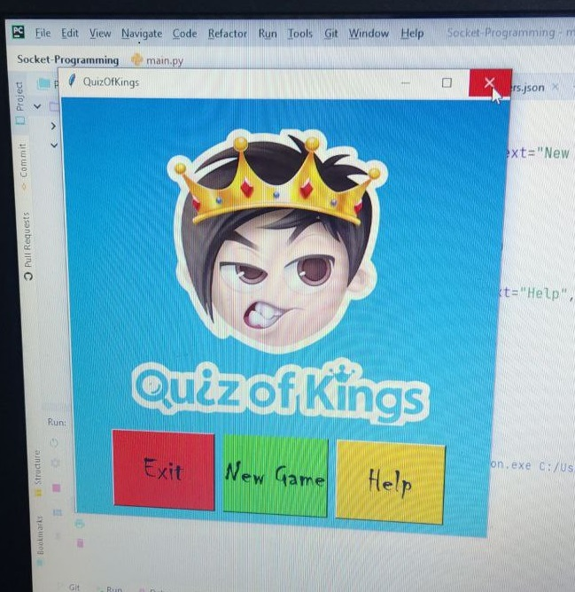
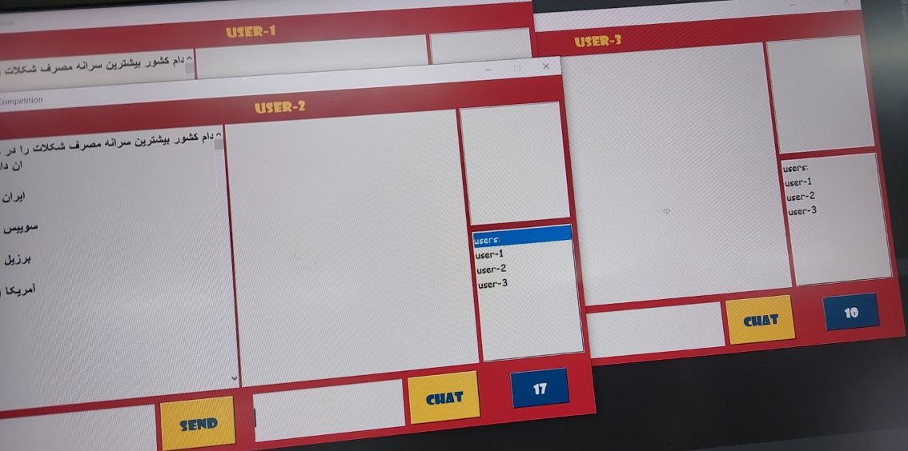

# Socket-Programming
Computer Network Project - It is all about an online competetion that a host send questions to clients and then clients have a limited time to answer that.

## ⚡️ Competition rules

First of all, the first question will be sent to you, and you have 45 seconds to answer that, meanwhile, only the first answer you sent will be considered and no points will be given to the subsequent answers. Then the scoreboard will be displayed in 5 seconds, after that, time is included for you to chat, and you can send a message to the desired user with the syntax chat#username. After the chat time ends, the next question is sent and the same process continues.

##  ⚡️ Game Play

